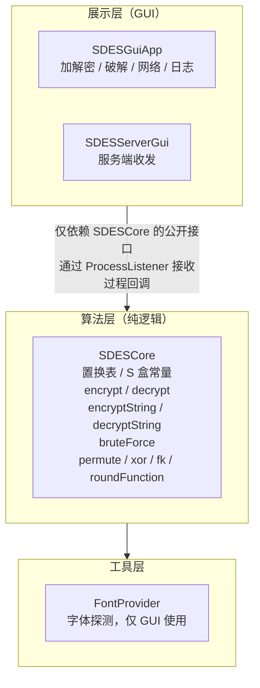

# S-DES 开发手册

> 阅读前建议先浏览根目录 [README.md](../README.md)。

---

## 目录

- [1. 架构总览](#1-架构总览)

- [2. 模块划分](#2-模块划分)

- [3. 核心接口：](#3-核心接口sdescore)

              - 3.1 [单字符加解密](#31-单字符加解密)

              - 3.2 [带日志的单字符加解密](#32-带日志的单字符加解密)

              - 3.3 [字符串加解密](#33-字符串加解密)

              - 3.4 [带日志的字符串加解密](#34-带日志的字符串加解密)

              - 3.5 [密钥扩展](#35-密钥扩展)

              - 3.6 [底层转换函数](#36-底层转换函数)

              - 3.7 [工具方法](#37-工具方法)

              - 3.8 [暴力破解](#38-暴力破解)

- [4. 回调接口：](#4-回调接口processlistener)

- [5. 结果封装：](#5-结果封装bruteforceresult)

- [6. 字体工具：](#6-字体工具fontprovider)

- [7. 集成示例](#7-集成示例)

- [8. 扩展指南](#8-扩展指南)

- [9. 已知限制](#9-已知限制)

---

## 1. 架构总览

项目采用**分层架构**，算法层与展示层严格解耦：


```

---

## 2. 模块划分

| 类                          | 包     | 职责                                  | 依赖                       |
| --------------------------- | ------ | ------------------------------------- | -------------------------- |
| `SDESCore`                  | `sdes` | S-DES 全部算法逻辑                    | 无                         |
| `SDESCore.ProcessListener`  | `sdes` | 过程回调接口                          | 无                         |
| `SDESCore.BruteForceResult` | `sdes` | 破解结果封装                          | 无                         |
| `FontProvider`              | `sdes` | 跨平台中文字体探测                    | `java.awt.*`               |
| `SDESGuiApp`                | `sdes` | 主界面（加解密 / 破解 / 网络 / 日志） | `SDESCore`、`FontProvider` |
| `SDESServerGui`             | `sdes` | 服务端 GUI（监听 + 主动发送）         | `SDESCore`、`FontProvider` |

---

## 3. 核心接口：`SDESCore`

`SDESCore` 是 `final` 类，**私有构造**，所有方法均为 `public static`，**无需实例化**。

**示例1**：

```java
public final class SDESCore {

    private SDESCore() {}

    // 全部方法为 static

}
### 3.1 单字符加解密
```

#### `encrypt`

```java
public static String encrypt(String plainText8, String key10)
```

    **功能**：对 8-bit 明文用 10-bit 密钥加密，返回 8-bit 密文。

    **参数**：

- `plainText8`：长度 8 的二进制串（仅含 `'0'`/`'1'`）
- `key10`：长度 10 的二进制串

**返回**：长度 8 的二进制串

**抛出**：`IllegalArgumentException` —— 输入长度不对或含非法字符


**示例2**：

```java
String c = SDESCore.encrypt("10000001", "1010000010");
// c = "11100111"
```

#### `decrypt`

```java
public static String decrypt(String cipherText8, String key10)
```

**功能**：对 8-bit 密文解密，返回 8-bit 明文。

**参数 / 返回 / 异常**：同 `encrypt`


---

### 3.2 带日志的单字符加解密

#### `encryptWithLog`

```java
public static String encryptWithLog(String plainText8, String key10,
                                    ProcessListener listener)
```

**功能**：与 `encrypt` 结果完全相同，但在每一步运算时通过 `listener` 回调中间值。

**回调顺序**：

1. `输入`：明文、密钥
2. `密钥扩展`：k1、k2
3. `初始置换 IP`：结果 + L0/R0
4. `第 1 轮 F(R0,k1)`：轮函数输出
5. `第 1 轮 L0⊕F`：异或结果
6. `第 1 轮 f_k1 输出`
7. `交换 SW`：结果 + L2/R2
8. `第 2 轮 F(R2,k2)`
9. `第 2 轮 L2⊕F`
10. `第 2 轮 f_k2 输出`
11. `逆初始置换 IP⁻¹`
12. `输出`：密文

**参数**：

- `listener` 可为 `null` —— 此时等同于 `encrypt`，不产生任何回调

**返回**：8-bit 密文（与 `encrypt` 一致）


**示例**：

```java
String c = SDESCore.encryptWithLog("10000001", "1010000010",
        (group, field, value) -> System.out.println(field + " = " + value));
```

#### `decryptWithLog`

```java
public static String decryptWithLog(String cipherText8, String key10,
                                    ProcessListener listener)
```

**功能**：与 `decrypt` 结果相同，带过程回调。回调顺序与加密类似，但第 1 轮用 k2、第 2 轮用 k1。

---

### 3.3 字符串加解密

#### `encryptString`

```java
public static String encryptString(String message, String key10)
```

**功能**：对字符串逐字符加密。**每个字符取 ASCII 作为 8-bit 明文分组**，加密后把 8-bit 密文按字节还原为字符，拼装成密文字符串。

**参数**：

- `message`：任意字符串
- `key10`：10-bit 密钥

**返回**：与输入**等长**的密文字符串（可能包含不可打印字符）

**注意**：

- 若原字符串包含**非 ASCII** 字符（如中文），`(int) ch` 会取到 16 位码点，`toBinaryString(c, 8)` 会**截断为低 8 位**，导致不可逆。**建议只传 ASCII 字符串**。
- 传输时**必须用 `ISO-8859-1`** 编码，不能用 `UTF-8`（会破坏密文字节）。

  

**示例**：

```java
String cipher = SDESCore.encryptString("Hello", "1010000010");
String plain  = SDESCore.decryptString(cipher, "1010000010");
// plain.equals("Hello") == true
```

#### `decryptString`

```java
public static String decryptString(String cipherMessage, String key10)
```

**功能**：`encryptString` 的逆运算。

---

### 3.4 带日志的字符串加解密

#### `encryptStringWithLog`

```java
public static String encryptStringWithLog(String message, String key10,
                                          ProcessListener listener)
```

**功能**：与 `encryptString` 结果相同，逐字符回调每组过程。

**每组回调字段**（`groupLabel` 为 `"第 N 组"`）：

| fieldName      | 含义                                                  |
| -------------- | ----------------------------------------------------- |
| `原字符`       | 该字符本身                                            |
| `ASCII 十进制` | 字符的 ASCII 码                                       |
| `8-bit 二进制` | 明文的 8-bit 表示                                     |
| `S-DES 密文`   | 加密结果（二进制 + 十进制）                           |
| `密文字符`     | 密文字节对应的字符（可打印则显示，否则标注 ASCII 值） |

**整体回调**（`groupLabel` 为空串）：

- `算法输入`：明文、密钥
- `拼装完成`：密文长度

  

**示例**：

```java
SDESCore.encryptStringWithLog("Hi", "1010000010",
        (group, field, value) -> {
            if (!group.isEmpty()) System.out.print(group + " | ");
            System.out.println(field + ": " + value);
        });
```

输出：

```
第 1 组 | 原字符: 'H'
第 1 组 | ASCII 十进制: 72
第 1 组 | 8-bit 二进制: 01001000
第 1 组 | S-DES 密文: 11010010  (十进制 210)
第 1 组 | 密文字符: 不可打印 ASCII:210
第 2 组 | 原字符: 'i'
...
```

#### `decryptStringWithLog`

```java
public static String decryptStringWithLog(String cipherMessage, String key10,
                                          ProcessListener listener)
```

**每组回调字段**：`密文字符` → `密文 8-bit 二进制` → `S-DES 明文` → `还原字符`。

---

### 3.5 密钥扩展

#### `generateSubKeys`

```java
public static String[] generateSubKeys(String key10)
```

**功能**：由 10-bit 主密钥扩展出两个 8-bit 子密钥。

**算法**：

```
P10(K) → (L0, R0)
L1 = LeftShift^1(L0), R1 = LeftShift^1(R0) → k1 = P8(L1 || R1)
L2 = LeftShift^2(L1), R2 = LeftShift^2(R1) → k2 = P8(L2 || R2)
```

**返回**：`String[2]`，`[0] = k1`，`[1] = k2`


**示例**：

```java
String[] k = SDESCore.generateSubKeys("1010000010");
// k[0] = "10100100"
// k[1] = "01000011"
```

---

### 3.6 底层转换函数

以下方法均为 `public static`，供**高级用户**自定义流程或做教学演示。

#### `permute`

```java
public static String permute(String input, int[] table)
```

**功能**：按 1-based 索引表重排输入位串。

**参数**：

- `input`：任意长度位串
- `table`：置换表，元素为 1-based 下标

**返回**：长度 = `table.length` 的位串


**示例**：

```java
SDESCore.permute("10111101", new int[]{2,6,3,1,4,8,5,7});
// = "01111110"  （IP 置换）
```

#### `xor`

```java
public static String xor(String a, String b)
```

**功能**：两个**等长**二进制串按位异或。

**抛出**：`IllegalArgumentException` —— 长度不等

#### `roundFunction`

```java
public static String roundFunction(String rightHalf, String subKey)
```

**功能**：S-DES 轮函数 `F(R, K) = SPBox(SBox(EPBox(R) ⊕ K))`。

**参数**：

- `rightHalf`：4-bit 串
- `subKey`：8-bit 子密钥

**返回**：4-bit 串

#### `fk`

```java
public static String fk(String input8, String subKey)
```

**功能**：单轮 Feistel 结构 `L' || R`，其中 `L' = L ⊕ F(R, K)`，`R` 保持不变。

**参数**：8-bit 输入 + 8-bit 子密钥

**返回**：8-bit 结果

#### `swapHalves`

```java
public static String swapHalves(String input8)
```

**功能**：交换 8-bit 串的左右 4 bit。

#### `leftShift`

```java
public static String leftShift(String bits, int shift)
```

**功能**：对位串做循环左移 `shift` 位。

---

### 3.7 工具方法

#### `validateBinary`

```java
public static void validateBinary(String bits, int expectedLength, String name)
```

**功能**：校验二进制串长度和字符合法性。

**抛出**：`IllegalArgumentException` —— 长度不符或含非 `'0'`/`'1'` 字符

**用途**：所有公开入口方法均先调用它做参数校验。

#### `toBinaryString`

```java
public static String toBinaryString(int value, int length)
```

**功能**：整数转固定长度二进制串（左侧补零，**只保留最低 `length` 位**）。

**注意**：掩码按 `length` 动态计算，**不是固定 `& 0xFF`**。这样才能正确生成 10-bit 密钥。

**示例**：

```java
SDESCore.toBinaryString(642, 10);   // "1010000010"
SDESCore.toBinaryString(72, 8);     // "01001000"
```

#### `isPrintable`

```java
public static boolean isPrintable(char c)
```

**功能**：判断字符是否为可打印 ASCII（32 ≤ c < 127）。

---

### 3.8 暴力破解

#### `bruteForce`

```java
public static BruteForceResult bruteForce(String knownPlainText8,
                                          String cipherText8,
                                          ProcessListener listener)
```

**功能**：已知明文攻击。穷举 1024 个密钥（`0000000000` ~ `1111111111`），
找出所有使 `encrypt(P, K) == C` 的候选密钥，统计耗时。

**参数**：

- `knownPlainText8`：已知的 8-bit 明文
- `cipherText8`：对应的 8-bit 密文
- `listener`：每命中一个候选密钥，回调一次 `onStep("", "命中候选", "K = ...")`

**返回**：`BruteForceResult`（见第 5 节）

**复杂度**：O(1024 × 单次加密耗时) ≈ 15 ms（实测）

**示例**：

```java
SDESCore.BruteForceResult r =
    SDESCore.bruteForce("10000001", "11100111", null);
System.out.println("候选：" + r.candidates);
System.out.printf("耗时：%.3f ms%n", r.elapsedMillis());
```

输出：

```
候选：[1010000010]
耗时：15.372 ms
```

---

## 4. 回调接口：`ProcessListener`

```java
public interface ProcessListener {
    void onStep(String groupLabel, String fieldName, String value);
}
```

**参数含义**：

| 参数         | 说明                                                                      |
| ------------ | ------------------------------------------------------------------------- |
| `groupLabel` | 组别标签。字符串加密时为 `"第 N 组"`；整体说明或单字符加解密时为空串 `""` |
| `fieldName`  | 字段名，如 `"输入"`、`"初始置换 IP"`、`"S-DES 密文"`                      |
| `value`      | 字段值                                                                    |

**典型用法**：

```java
// 1. 打印到控制台
ProcessListener print = (g, f, v) -> {
    if (g.isEmpty()) System.out.println(f + ": " + v);
    else System.out.println("[" + g + "] " + f + ": " + v);
};

// 2. 追加到 Swing 文本区（注意线程安全）
ProcessListener toArea = (g, f, v) ->
    SwingUtilities.invokeLater(() -> area.append(f + ": " + v + "\n"));

// 3. 只要结果，不要过程
ProcessListener none = null;

// 4. 只关心命中候选
ProcessListener onlyHit = (g, f, v) -> {
    if ("命中候选".equals(f)) System.out.println(v);
};
```

**实现约束**：

- 回调在**调用线程**中同步执行 —— 如果从后台线程调用 `bruteForce`，listener 也在后台线程执行，**不要直接操作 Swing 组件**，需 `SwingUtilities.invokeLater`。
- listener 应**快速返回**，避免阻塞加密流程。

---

## 5. 结果封装：`BruteForceResult`

```java
public static class BruteForceResult {
    public final String cipherText;
    public final String knownPlainText;
    public final List<String> candidates;
    public final long elapsedNanos;
    public final int totalTried;

    public double elapsedMillis();
    public double averageNanosPerKey();
}
```

| 成员                   | 类型           | 说明                           |
| ---------------------- | -------------- | ------------------------------ |
| `cipherText`           | `String`       | 被破解的密文                   |
| `knownPlainText`       | `String`       | 已知明文                       |
| `candidates`           | `List<String>` | 所有候选密钥（0 个表示未找到） |
| `elapsedNanos`         | `long`         | 总耗时（纳秒）                 |
| `totalTried`           | `int`          | 穷举的密钥总数（恒为 1024）    |
| `elapsedMillis()`      | `double`       | 总耗时（毫秒，保留小数）       |
| `averageNanosPerKey()` | `double`       | 平均每密钥耗时（纳秒）         |

**结果解读**：

- `candidates.size() == 1`：唯一密钥
- `candidates.size() > 1`：存在多个候选，需**多组 (P,C)** 进一步筛选
- `candidates.size() == 0`：未找到（检查输入是否一致）

---

## 6. 字体工具：`FontProvider`

`FontProvider` 负责**跨平台中文字体探测**，解决 Swing 在中文字体缺失时显示方块的问题。

**核心机制**：

```java
String[] names = GraphicsEnvironment.getLocalGraphicsEnvironment()
        .getAvailableFontFamilyNames();
```

启动时枚举系统字体，按候选列表顺序取第一个可用的。

**三个字体族**：

| 族    | 用途            | 候选（按优先级）                                 |
| ----- | --------------- | ------------------------------------------------ |
| TITLE | 标题、状态栏    | Songti SC / SimSun / Noto Serif CJK              |
| UI    | 标签、按钮、Tab | Microsoft YaHei UI / PingFang SC / Noto Sans CJK |
| MONO  | 输入框、日志    | Sarasa Mono SC / Noto Sans Mono CJK / Monospaced |

**公开方法**：

| 方法                 | 返回字体             |
| -------------------- | -------------------- |
| `appTitle()`         | 衬线 24 Bold         |
| `appSubtitle()`      | 衬线 12 Italic       |
| `sectionTitle()`     | 无衬线 15 Bold       |
| `label()`            | 无衬线 13 Bold       |
| `body()`             | 无衬线 13 Plain      |
| `button()`           | 无衬线 13 Bold       |
| `tab()`              | 无衬线 13 Bold       |
| `input()`            | 等宽 14 Plain        |
| `log()`              | 等宽 13 Plain        |
| `resultMono()`       | 等宽 14 Plain        |
| `hint()`             | 无衬线 12 Plain      |
| `status()`           | 衬线 11 Italic       |
| `printDiagnostics()` | 打印实际选中的字体名 |

**集成到新 GUI**：

```java
JLabel title = new JLabel("我的应用");
title.setFont(FontProvider.appTitle());

UIManager.put("Label.font",    FontProvider.label());
UIManager.put("Button.font",   FontProvider.button());
UIManager.put("TextField.font", FontProvider.input());
```

**只调用 `SDESCore`、不用 GUI 的项目无需引入 `FontProvider`。**

---

## 7. 集成示例

### 7.1 命令行加解密

```java
public class CliDemo {
    public static void main(String[] args) {
        String key = "1010000010";
        String plain = "10000001";
        String cipher = SDESCore.encrypt(plain, key);
        String restored = SDESCore.decrypt(cipher, key);

        System.out.println("明文 = " + plain);
        System.out.println("密文 = " + cipher);
        System.out.println("解密 = " + restored);
    }
}
```

### 7.2 批量加解密文件（逐字节）

```java
public static byte[] encryptBytes(byte[] data, String key10) {
    byte[] out = new byte[data.length];
    for (int i = 0; i < data.length; i++) {
        String bits = SDESCore.toBinaryString(data[i] & 0xFF, 8);
        String enc  = SDESCore.encrypt(bits, key10);
        out[i] = (byte) Integer.parseInt(enc, 2);
    }
    return out;
}

public static byte[] decryptBytes(byte[] data, String key10) {
    byte[] out = new byte[data.length];
    for (int i = 0; i < data.length; i++) {
        String bits = SDESCore.toBinaryString(data[i] & 0xFF, 8);
        String dec  = SDESCore.decrypt(bits, key10);
        out[i] = (byte) Integer.parseInt(dec, 2);
    }
    return out;
}
```

### 7.3 用回调把过程写进日志

```java
StringBuilder sb = new StringBuilder();
SDESCore.ProcessListener collector = (group, field, value) -> {
    if (!group.isEmpty()) sb.append('[').append(group).append("] ");
    sb.append(field).append(": ").append(value).append('\n');
};

SDESCore.encryptWithLog("10000001", "1010000010", collector);
System.out.println(sb);
```

### 7.4 暴力破解并筛选唯一密钥

```java
// 用第一组明密文缩小候选
SDESCore.BruteForceResult r1 = SDESCore.bruteForce("10000001", "11100111", null);
List<String> candidates = r1.candidates;

// 用第二组明密文进一步筛选
String p2 = "01010101";
String c2 = SDESCore.encrypt(p2, "1010000010");   // 实际场景中 c2 是已知的
candidates.removeIf(k -> !SDESCore.encrypt(p2, k).equals(c2));

System.out.println("唯一密钥：" + candidates);
```

---

## 8. 扩展指南

### 8.1 增加新的置换表

在 `SDESCore` 常量区新增：

```java
private static final int[] MY_PBOX = { /* 1-based 索引 */ };
```

调用通用置换：

```java
String result = SDESCore.permute(input, MY_PBOX);
```

### 8.2 更换 S 盒

修改 `S_BOX_1` / `S_BOX_2` 常量即可，所有依赖它们的流程自动更新。
**注意**：换 S 盒会改变加解密结果，需同步更新测试向量。

### 8.3 增加多线程暴力破解

当前 `bruteForce` 是单线程。若需加速，可按密钥空间分片：

```java
public static List<String> bruteForceParallel(String p, String c, int threads) {
    List<String> hits = Collections.synchronizedList(new ArrayList<>());
    int perThread = 1024 / threads;
    Thread[] ts = new Thread[threads];
    for (int t = 0; t < threads; t++) {
        final int start = t * perThread;
        final int end = (t == threads - 1) ? 1024 : (t + 1) * perThread;
        ts[t] = new Thread(() -> {
            for (int k = start; k < end; k++) {
                String key = toBinaryString(k, 10);
                if (encrypt(p, key).equals(c)) hits.add(key);
            }
        });
        ts[t].start();
    }
    for (Thread th : ts) {
        try { th.join(); } catch (InterruptedException ignored) {}
    }
    return hits;
}
```

> 对 S-DES 而言 1024 个密钥穷举仅需约 15 ms，多线程收益有限，仅作教学演示。

### 8.4 支持非 ASCII 字符串

`encryptString` 只处理低 8 位。若需支持中文，建议先 `UTF-8` 编码成字节数组，再逐字节加密：

```java
public static byte[] encryptUtf8(String msg, String key) throws Exception {
    return encryptBytes(msg.getBytes("UTF-8"), key);
}
```

解密后 `new String(plainBytes, "UTF-8")` 还原。

### 8.5 增加新 UI 主题

在 `SDESGuiApp` 中把配色常量集中在一处，替换 `CREAM_*` / `RETRO_*` 即可换肤。
字体统一走 `FontProvider`，无需改动组件代码。

---

## 9. 已知限制

| 限制                                   | 说明                | 影响                         |
| -------------------------------------- | ------------------- | ---------------------------- |
| 密钥空间极小                           | 仅 1024 个密钥      | 易被暴力破解，**仅用于教学** |
| 分组长度短                             | 8 bit               | 只适合演示，不适合真实加密   |
| 单组 (P,C) 无法唯一确定密钥            | 平均 4 个候选       | 需多组明密文对               |
| 字符串按低 8 位截断                    | 非 ASCII 字符会丢失 | 建议只传 ASCII               |
| `encryptString` 密文可能含不可打印字符 | 显示为乱码          | 传输用 `ISO-8859-1` 编码     |
| 单线程暴力破解                         | 1024 次循环         | 已足够快，多线程仅教学       |
| TCP 无加密握手 / 认证                  | 明文密钥共享        | 仅演示用，不可用于生产       |

---

## 附录 A：完整测试向量

| 密钥 K       | 明文 P     | 密文 C       | 解密 P'    |
| ------------ | ---------- | ------------ | ---------- |
| `1010000010` | `10000001` | `11100111`   | `10000001` |
| `0000000000` | `00000000` | （实测填入） | `00000000` |
| `1111111111` | `11111111` | （实测填入） | `11111111` |
| `1010000010` | `00000000` | （实测填入） | `00000000` |
| `0111111101` | `10101010` | （实测填入） | `10101010` |

> 交叉测试时，双方必须使用**完全相同的置换表 / S 盒**，对同一组 (P,K) 加密结果必须一致。

## 附录 B：子密钥验证

密钥 `1010000010` 的子密钥：

| 子密钥 | 值         |
| ------ | ---------- |
| k1     | `10100100` |
| k2     | `01000011` |

若你的实现得到的 k1/k2 与上表不同，请检查 `P10`、`P8`、`LeftShift` 的定义。


