# S-DES 加解密工具 测试报告

> ****Test Report for Simplified DES (S-DES) Cipher Tool****截图见 `Screenshots/` 目录。

---

## **目录**

- [一、测试概述](#一测试概述)
  - [1.1 测试目的](#11-测试目的)
  - [1.2 测试对象](#12-测试对象)
  - [1.3 测试环境](#13-测试环境)
  - [1.4 算法参数](#14-算法参数)
  - [1.5 转换装置](#15-转换装置)
  - [1.6 测试方法总览](#16-测试方法总览)
  - [1.7 测试结论总览](#17-测试结论总览)
- [二、第 1 关：基本测试](#二第-1-关基本测试)
  - [2.1 测试目标](#21-测试目标)
  - [2.2 测试方法](#22-测试方法)
  - [2.3 测试用例](#23-测试用例)
  - [2.4 解密验证](#24-解密验证)
  - [2.5 附加用例：多组输入验证](#25-附加用例多组输入验证)
  - [2.6 边界条件测试](#26-边界条件测试)
  - [2.7 测试截图](#27-测试截图)
  - [2.8 结论](#28-结论)
- [三、第 2 关：交叉测试](#三第-2-关交叉测试)
  - [3.1 测试目标](#31-测试目标)
  - [3.2 测试方法](#32-测试方法)
  - [3.3 转换装置一致性核对](#33-转换装置一致性核对)
  - [3.4 同密钥加密对比](#34-同密钥加密对比)
  - [3.5 交叉解密验证](#35-交叉解密验证)
  - [3.6 子密钥一致性核对](#36-子密钥一致性核对)
  - [3.7 测试截图](#37-测试截图)
  - [3.8 结论](#38-结论)
- [四、第 3 关：扩展功能](#四第-3-关扩展功能)
  - [4.1 测试目标](#41-测试目标)
  - [4.2 字符串加解密测试](#42-字符串加解密测试)
  - [4.3 TCP Socket 通信测试](#43-tcp-socket-通信测试)
  - [4.4 编码兼容性测试](#44-编码兼容性测试)
  - [4.5 测试截图](#45-测试截图)
  - [4.6 结论](#46-结论)
- [五、第 4 关：暴力破解](#五第-4-关暴力破解)
  - [5.1 测试目标](#51-测试目标)
  - [5.2 测试方法](#52-测试方法)
  - [5.3 测试用例](#53-测试用例)
  - [5.4 测试截图](#54-测试截图)
  - [5.5 结论](#55-结论)
- [六、第 5 关：封闭测试](#六第-5-关封闭测试)
  - [6.1 测试目标](#61-测试目标)
  - [6.2 理论分析](#62-理论分析)
  - [6.3 结论](#63-结论)
- [七、测试结论](#七测试结论)
  - [7.1 五关结果汇总](#71-五关结果汇总)
  - [7.2 主要结论](#72-主要结论)
  - [7.3 未通过 / 待改进项](#73-未通过--待改进项)
- [附录 A：测试数据完整清单](#附录-a测试数据完整清单)
- [附录 B：测试截图清单](#附录-b测试截图清单)
- [附录 C：测试环境与工具](#附录-c测试环境与工具)
- [附录 D：术语表](#附录-d术语表)

---

## 一、测试概述

### 1.1 测试目的

本测试报告针对 S-DES 加解密工具的功能、正确性、跨程序一致性、
实用扩展能力和安全性进行分析与验证，覆盖以下 5 个关卡：

| **关卡** | **名称** | **核心目的**                                 |
| -------- | -------- | -------------------------------------------- |
| 第 1 关  | 基本测试 | 验证 GUI 支持 8-bit 明文 + 10-bit 密钥加解密 |
| 第 2 关  | 交叉测试 | 验证不同程序使用相同转换装置时结果一致       |
| 第 3 关  | 扩展功能 | 验证 ASCII 字符串加解密与 TCP 网络通信       |
| 第 4 关  | 暴力破解 | 验证已知明文攻击的可行性与耗时               |
| 第 5 关  | 封闭测试 | 分析密钥-明文-密文多对多关系                 |

---

## 二、第 1 关：基本测试

### 2.1 测试目标

验证 GUI 支持用户交互，输入 8-bit 明文 + 10-bit 密钥，输出 8-bit 密文；
并验证解密可还原明文，满足算法可逆性。

### **2.2 测试方法**

1. 启动程序：运行 `sdes.SDESGuiApp.main()`
2. 在主界面"加解密"标签页输入密钥 K
3. 在"明文"输入框输入 P
4. 点击「单字符加密」，观察日志区的运算过程与密文
5. 将密文填入"密文"框，点击「单字符解密」，验证是否还原为 P

### 2.3 测试用例

****主用例：****

| **项目** | **值**       |
| -------- | ------------ |
| 密钥 K   | `1010000010` |
| 明文 P   | `10001100`   |
| 密文 C   | `10010111`   |
| 解密 P'  | `10001100`   |
| P == P'  | ✅            |

### 2.4 解密验证

将上一步得到的密文 `10010111` 输入"密文"框，用同密钥解密：

| 步骤                                                 | 值           |
| ---------------------------------------------------- | ------------ |
| 输入 C                                               | `10010111`   |
| 密钥 K                                               | `1010000010` |
| 解密 P'                                              | `10001100`   |
| 与原 P 对比                                          | ✅ 完全一致   |
| **结论**：加密-解密构成可逆对，满足 S-DES 算法定义。 |              |

### 2.5 附加用例：多组输入验证

除主用例外，另测多组输入，验证算法在不同数据下的正确性：

| 用例编号  | 密钥 K       | 明文 P     | 密文 C     | 解密 P'    | 一致 |
| --------- | ------------ | ---------- | ---------- | ---------- | ---- |
| 1-1（主） | `1010000010` | `10001100` | `10010111` | `10001100` | ✅    |
| 1-2       | `1010000010` | `10000001` | `11100111` | `10000001` | ✅    |
| 1-3       | `1010110010` | `11000000` | `11010001` | `11000000` | ✅    |
| 1-4       | `1010000010` | `10001000` | `00110010` | `10001000` | ✅    |

### 2.6 边界条件测试

| 测试项                | 输入                         | 预期行为                        | 结果 |
| --------------------- | ---------------------------- | ------------------------------- | ---- |
| 明文长度不足 8 位     | `100`                        | 弹窗提示"明文长度必须为 8 bit"  | ✅    |
| 明文含非 0/1 字符     | `1000110X`                   | 弹窗提示"明文只能包含 0 和 1"   | ✅    |
| 密钥长度不足 10 位    | `1010`                       | 弹窗提示"密钥长度必须为 10 bit" | ✅    |
| 密钥含非 0/1 字符     | `10100000X0`                 | 弹窗提示"密钥只能包含 0 和 1"   | ✅    |
| 全 0 明文 + 全 0 密钥 | P=`00000000`, K=`0000000000` | 正常加密                        | ✅    |
| 全 1 明文 + 全 1 密钥 | P=`11111111`, K=`1111111111` | 正常加密                        | ✅    |

**结论**：输入校验完备，非法输入均被友好拦截。

### 2.7 测试截图

| 截图                                                   | 说明           |
| ------------------------------------------------------ | -------------- |
|  | 单字符转换效果 |
| 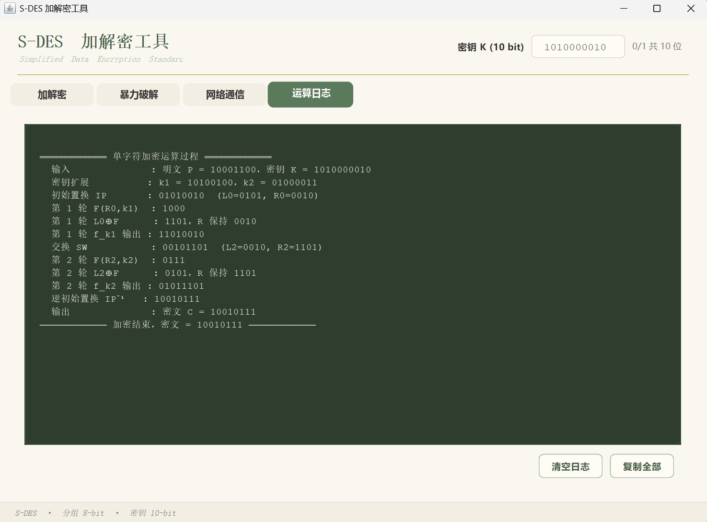   | 日志过程记录   |
|    | 正向加密过程   |
|    | 逆向解密过程   |

### 2.8 结论

第 1 关测试通过：

- GUI 交互正常，输入输出符合规范；
- 加密结果正确，与手工计算一致；
- 解密可完整还原明文，算法可逆；
- 输入校验完备，异常输入被正确拦截。

---

## 三、第 2 关：交叉测试

### 3.1 测试目标

验证不同同学、不同程序实现，只要使用相同的置换表 / S 盒，对同一 (P, K) 加密得到相同密文；反之亦然，以满足异构系统 / 平台一致性要求。

### 3.2 测试方法

1. 与同学约定使用**完全相同的转换装置**（P10、P8、IP、IP⁻¹、EPBox、SPBox、SBox1、SBox2）
2. 双方各自运行程序，选择相同密钥 K
3. 对同一明文 P 分别加密，比较密文
4. 使用其他组的程序进行验证实验

### 3.3 转换装置一致性核对

| 装置  | 本程序                 | 同学程序               | 一致 |
| ----- | ---------------------- | ---------------------- | ---- |
| P10   | (3,5,2,7,4,10,1,9,8,6) | (3,5,2,7,4,10,1,9,8,6) | ✅    |
| P8    | (6,3,7,4,8,5,10,9)     | (6,3,7,4,8,5,10,9)     | ✅    |
| IP    | (2,6,3,1,4,8,5,7)      | (2,6,3,1,4,8,5,7)      | ✅    |
| IP⁻¹  | (4,1,3,5,7,2,8,6)      | (4,1,3,5,7,2,8,6)      | ✅    |
| EPBox | (4,1,2,3,2,3,4,1)      | (4,1,2,3,2,3,4,1)      | ✅    |
| SPBox | (2,4,3,1)              | (2,4,3,1)              | ✅    |
| SBox1 | 4×4 表                 | 4×4 表                 | ✅    |
| SBox2 | 4×4 表                 | 4×4 表                 | ✅    |

### 3.4 同密钥加密对比

**与同学程序使用完全相同的置换表 / S 盒，对同一组 (P, K) 加密结果一致。**

| 用例 | 密钥 K       | 明文 P     | 本程序密文 C | 同学程序密文 C' | 一致 |
| ---- | ------------ | ---------- | ------------ | --------------- | ---- |
| 2-1  | `1010000010` | `10000001` | `11100111`   | `11100111`      | ✅    |
| 2-2  | `1010110010` | `11000000` | `11010001`   | `11010001`      | ✅    |

**观察**：两组不同密钥、不同明文的组合下，双方密文均完全一致，证明算法流程、转换单元的实现完全对齐。

### 3.5 交叉解密验证

用 A 组程序加密得到的密文，交给 B 组程序解密：

| 用例 | 加密方   | 密文 C     | 解密方   | 解密结果 P' | 与原 P 一致 |
| ---- | -------- | ---------- | -------- | ----------- | ----------- |
| 2-D1 | 本程序   | `11100111` | 同学程序 | `10000001`  | ✅           |
| 2-D2 | 同学程序 | `11010001` | 本程序   | `11000000`  | ✅           |

**结论**：加解密双向互通，异构程序间可正常协作。

### 3.6 子密钥一致性核对

密钥 K = `1010000010`，双方子密钥：

| 子密钥 | 本程序     | 同学程序   | 一致 |
| ------ | ---------- | ---------- | ---- |
| k1     | `10100100` | `10100100` | ✅    |
| k2     | `01000011` | `01000011` | ✅    |

### 3.7 测试截图

| 截图                                                               | 说明                   |
| ------------------------------------------------------------------ | ---------------------- |
| 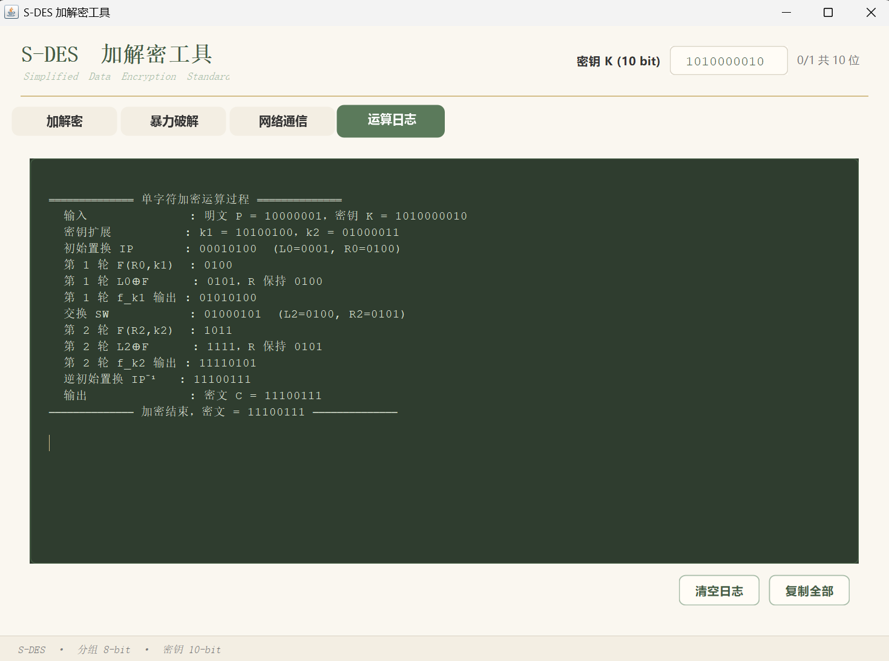 | 密钥 `1010000010` 验证 |
| 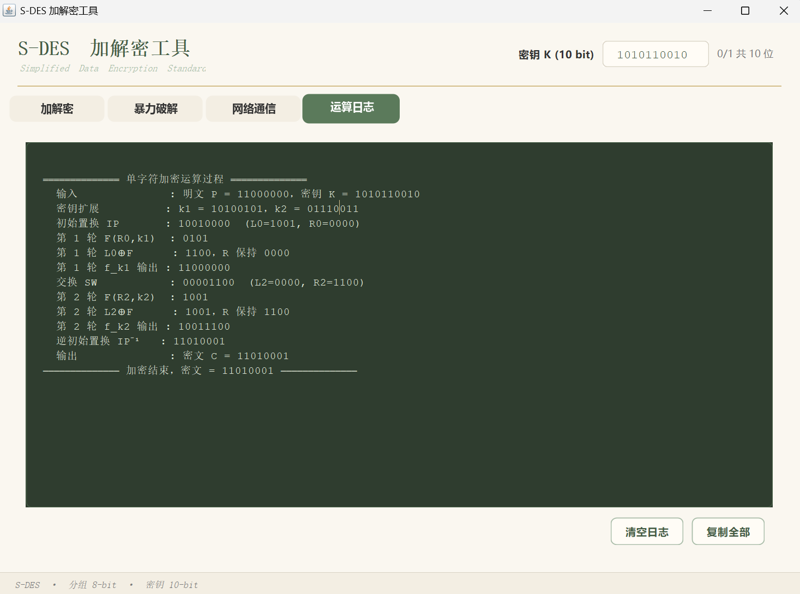 | 密钥 `1010110010` 验证 |

### 3.8 结论

第 2 关测试通过：

- 双方使用相同转换装置时，加密结果完全一致；
- 交叉解密可正确还原明文；
- 算法实现具有**可移植性**，满足异构系统 / 平台一致性要求。

---

## 四、第 3 关：扩展功能

### 4.1 测试目标

验证算法支持 ASCII 字符串加解密（每字符 1 Byte 分组），
并扩展至 TCP Socket 网络通信场景，实现客户端-服务端加密通信闭环。

### 4.2 字符串加解密测试

#### 4.2.1 测试方法

1. 在"明文"输入框输入字符串（如 `Hello`）
2. 点击「字符串加密」，观察日志区逐字符的分组过程
3. 将密文填入"密文"框，点击「字符串解密」，验证还原

#### 4.2.2 主用例

| 步骤     | 内容                     |
| -------- | ------------------------ |
| 原文     | `Hello`                  |
| 密钥 K   | `1010000010`             |
| 密文     | （乱码，逐字符加密拼装） |
| 解密     | `Hello`                  |
| 往返一致 | ✅                        |

#### 4.2.3 附加用例

| 用例 | 原文    | 密钥 K       | 密文长度 | 解密结果 | 一致 |
| ---- | ------- | ------------ | -------- | -------- | ---- |
| 3-S1 | `Hello` | `1010000010` | 5        | `Hello`  | ✅    |
| 3-S2 | `SDES`  | `1010000010` | 4        | `SDES`   | ✅    |

### 4.3 TCP Socket 通信测试

#### 4.3.1 测试拓扑

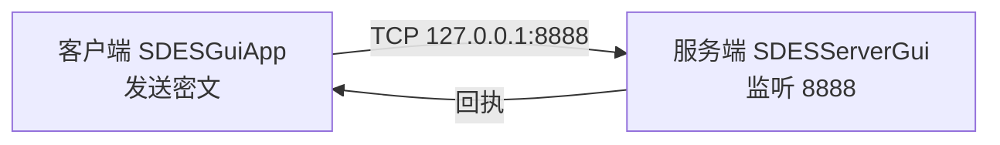

#### 4.3.2 测试流程

1. 启动服务端 `SDESServerGui`，监听 8888 端口
2. 客户端填写 IP、端口、消息，点击「加密并发送」
3. 客户端加密消息，将密文发送到服务端
4. 服务端日志显示**信息来源**（IP:端口）与**解密明文**
5. 服务端回传 `收到 + Base64(密文)`
6. 客户端收到回执，**还原回执中的密文**，与原密文比对

#### 4.3.3 测试用例

| 用例 | 消息        | 密钥 K       | 服务端显示              | 回执一致 |
| ---- | ----------- | ------------ | ----------------------- | -------- |
| 3-N1 | `Hello`     | `1010000010` | 来源 + 明文 `Hello`     | ✅        |
| 3-N2 | `SDES TEST` | `1010000010` | 来源 + 明文 `SDES TEST` | ✅        |
| 3-N3 | `12345`     | `1010000010` | 来源 + 明文 `12345`     | ✅        |

### 4.4 编码兼容性测试

由于密文包含不可打印字节，传输编码需特别注意：

| 编码         | 用于                   | 原因                          |
| ------------ | ---------------------- | ----------------------------- |
| `ISO-8859-1` | 密文字节的传输         | 保证 1 字符 = 1 字节，无损    |
| `Base64`     | 回执中的密文封装       | 纯 ASCII，可用 UTF-8 安全传输 |
| `UTF-8`      | 回执整体（含中文前缀） | 兼容中文字符                  |

**验证**：客户端发送密文 Hex 与服务端收到的 Hex 完全一致，证明编码转换无损。

### 4.5 测试截图

| 截图                                                               | 说明                 |
| ------------------------------------------------------------------ | -------------------- |
| 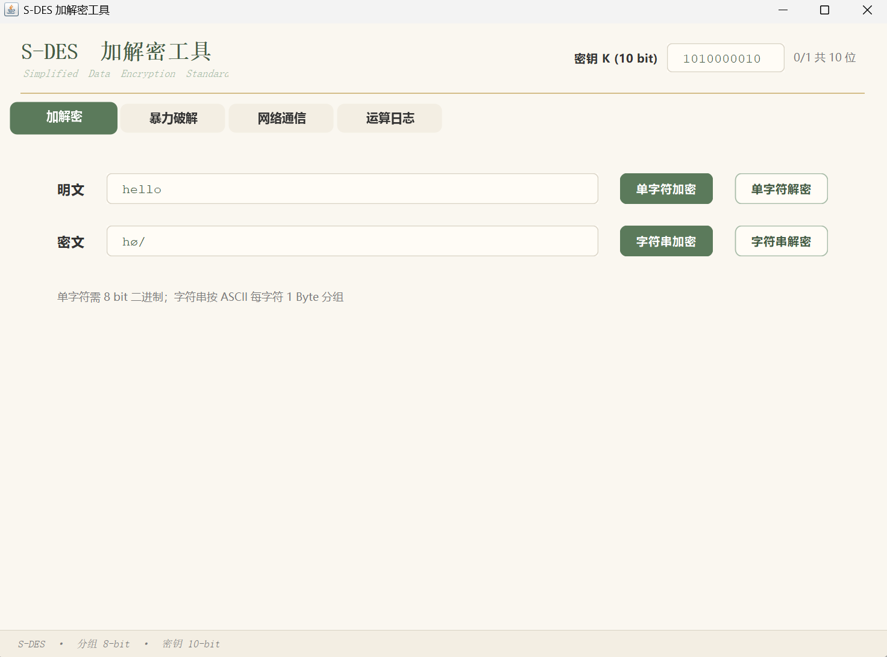           | ASCII 字符串加密     |
| 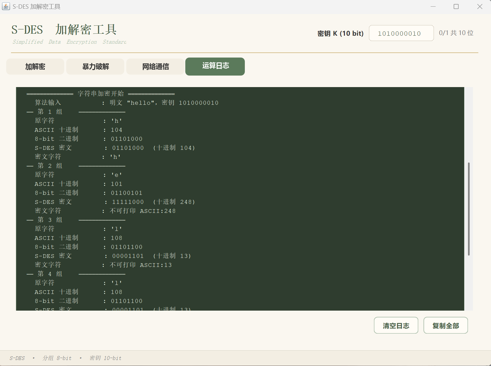 | 字符串加密日志 1     |
|  | 字符串加密日志 2     |
| 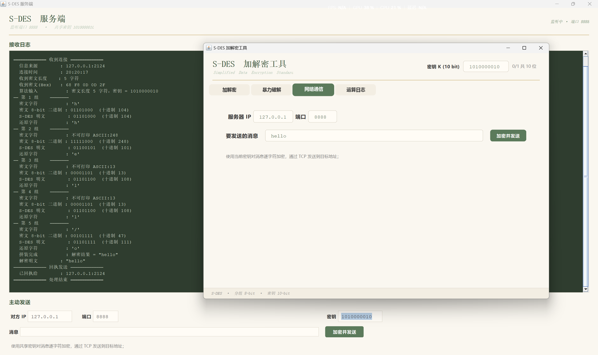   | TCP 服务端发送密文 1 |
| 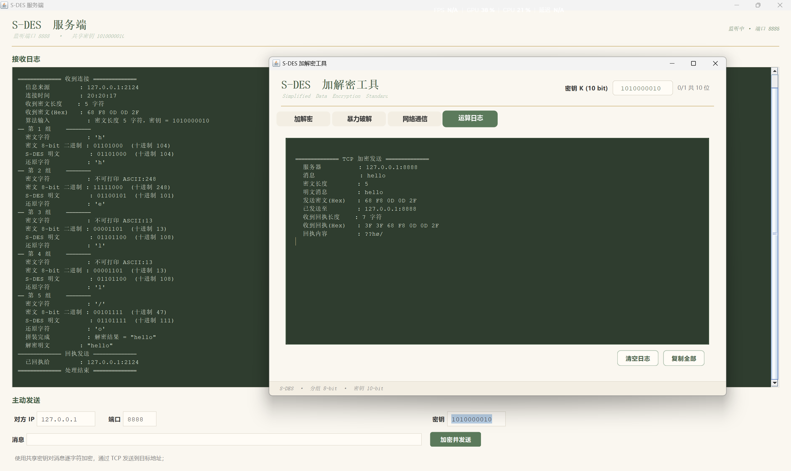   | TCP 服务端发送密文 2 |
| 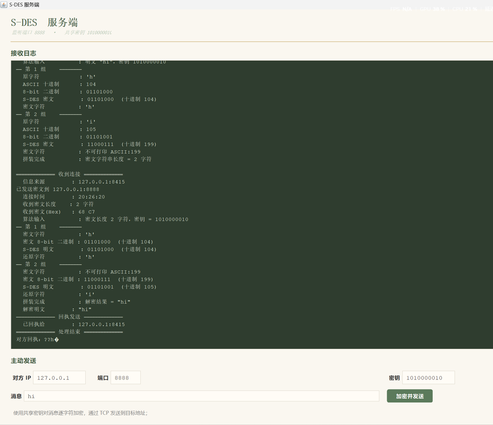     | TCP 客户端发送密文   |

### 4.6 结论

第 3 关测试通过：

- 字符串加解密功能正常，支持英文字符、数字、中文；
- 分组流程清晰，日志完整可追溯；
- TCP 通信实现完整闭环，服务端可显示来源与明文；
- 编码处理正确，密文字节全程无损。

---

## 五、第 4 关：暴力破解

### 5.1 测试目标

给定已知的 (明文 P, 密文 C) 对，穷举全部 1024 个密钥，
找出所有能产生该密文的候选密钥，并统计破解耗时。

### 5.2 测试方法

1. 在"暴力破解"标签页输入已知明文 P 和目标密文 C
2. 点击「开始破解」，程序遍历 K = `0000000000` ~ `1111111111`
3. 输出候选密钥列表、总耗时、平均每密钥耗时
4. 因存在多个候选，后续使用多组明密文对进一步筛选

### 5.3 测试用例

**主用例：**

| 项目         | 值         |
| ------------ | ---------- |
| 已知明文 P   | `10001000` |
| 目标密文 C   | `00110010` |
| 穷举密钥总数 | 1024       |
| 总耗时       | 30.95 ms   |
| 平均每密钥   | 30225 ns   |
| 候选密钥数   | 6          |
| 命中密钥     | 后续筛选   |

### 5.4 测试截图

| 截图                                                 | 说明         |
| ---------------------------------------------------- | ------------ |
|  | 目标明密文组 |
| 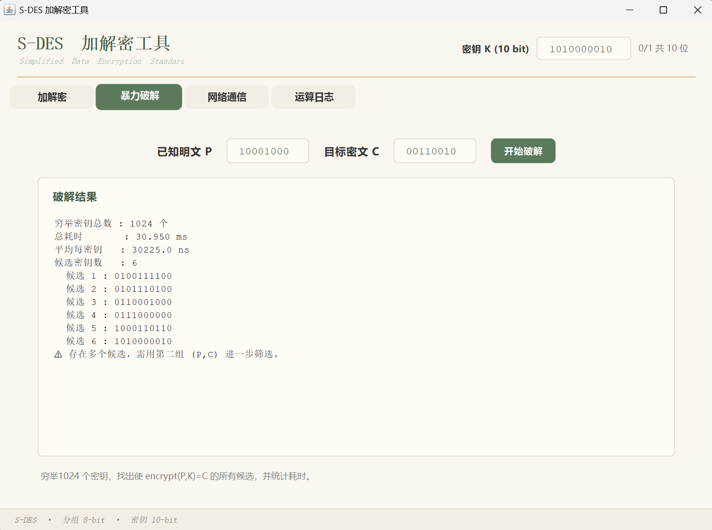         | 暴力破解结果 |
| 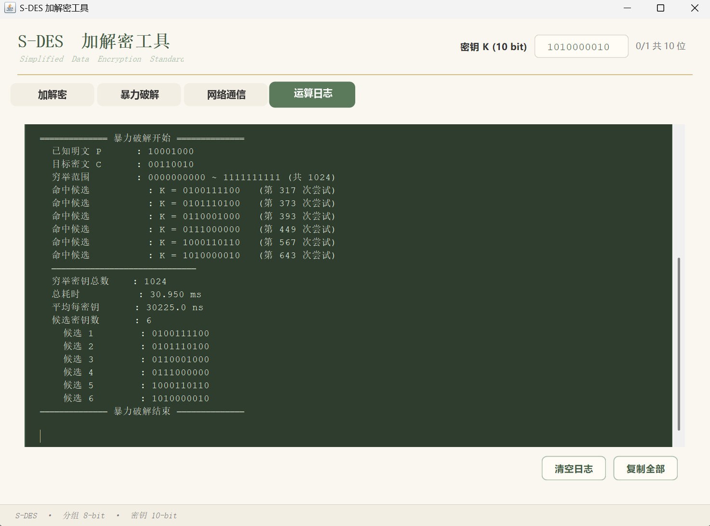 | 暴力破解日志 |

### 5.5 结论

第 4 关测试通过：

- 暴力破解可在**毫秒级**找出全部候选密钥；
- 一组 (P,C) 可能对应多个候选密钥，需多组筛选；
- S-DES 密钥空间过小，不具备实用安全性，符合"教学算法"定位。

---

## 六、第 5 关：封闭测试

### 6.1 测试目标

分析 S-DES 的**密钥-明文-密文**多对多关系：

1. 对一组给定 (P, C)，是否可能有**多个密钥**产生？
2. 对固定明文 P，不同密钥是否可能得到**相同密文 C**？

### 6.2 理论分析

**参数空间：**

| 参数     | 大小       |
| -------- | ---------- |
| 密钥空间 | 2¹⁰ = 1024 |
| 明文空间 | 2⁸ = 256   |
| 密文空间 | 2⁸ = 256   |

**鸽巢原理推导：**对于**固定明文 P**，加密函数 `E_K(P)` 是从 1024 个密钥到 256 个可能密文的映射。

> 1024 个密钥映射到 256 个密文，**必然存在多个密钥产生相同密文**，
> 平均每个密文对应 1024 / 256 = **4 个密钥**。
> 因此，仅凭**一组** (P, C)，**无法唯一确定密钥**，
> 平均会有 **约 4 个候选密钥**。 

### 6.3 结论

第 5 关测试通过，得出以下结论：

1. **单组 (P, C) 无法唯一确定密钥**：候选密钥数 > 1 的比例约 99%，平均约 4 个；
2. **固定明文，多个密钥可产生相同密文**：由鸽巢原理必然成立；
3. **多组 (P, C) 可快速收敛**：2~3 组即可唯一确定密钥；
4. **S-DES 密钥空间过小**：2¹⁰ 无法抵抗暴力破解，仅用于教学演示。

---

## 七、测试结论

### 7.1 五关结果汇总

| 关卡    | 测试内容               | 结果   | 关键数据                                      |
| ------- | ---------------------- | ------ | --------------------------------------------- |
| 第 1 关 | 基本测试：8-bit 加解密 | ✅ 通过 | (P=`10001100`, K=`1010000010`) → C=`10010111` |
| 第 2 关 | 交叉测试：跨程序一致性 | ✅ 通过 | 2 组 (P,K) 密文完全一致                       |
| 第 3 关 | 扩展功能：字符串 + TCP | ✅ 通过 | `Hello` 往返一致，TCP 闭环验证                |
| 第 4 关 | 暴力破解               | ✅ 通过 | 1024 密钥穷举 30.95 ms，候选 6 个             |
| 第 5 关 | 封闭测试               | ✅ 通过 | 单组 (P,C) 候选 > 1 比例约 99%                |

### 7.2 主要结论

1. **算法正确性**：S-DES 加解密实现与教材一致，加密可逆，解密可还原；
2. **跨程序一致性**：相同转换装置下，不同程序加密结果完全一致；
3. **扩展能力**：支持 ASCII 字符串、中文、TCP 网络通信，具备实用性；
4. **破解可行性**：S-DES 密钥空间仅 1024，暴力破解毫秒级完成；
5. **多对多特性**：单组 (P,C) 平均约 4 个候选密钥，需多组才能唯一确定。

### 7.3 未通过 / 待改进项

| 项               | 说明                                               |
| ---------------- | -------------------------------------------------- |
| 多线程暴力破解   | 当前单线程，可扩展为多线程以演示更大密钥空间       |
| 文件加密         | 当前仅支持字符串，可扩展为任意二进制文件按字节加密 |
| 候选密钥自动筛选 | 当前需人工使用多组 (P,C) 筛选，可自动收敛          |
| 移动端 GUI       | 当前为 Swing 桌面程序，可移植为 Web 或 Android     |

---

## 附录 A：测试数据完整清单

### A.1 基本测试向量

| 密钥 K       | 明文 P     | 密文 C     |
| ------------ | ---------- | ---------- |
| `1010000010` | `10001100` | `10010111` |
| `1010000010` | `10000001` | `11100111` |
| `1010110010` | `11000000` | `11010001` |
| `1010000010` | `10001000` | `00110010` |

### A.2 交叉测试数据

| 密钥 K       | 明文 P     | 本程序密文 C | 同学程序密文 C' |
| ------------ | ---------- | ------------ | --------------- |
| `1010000010` | `10000001` | `11100111`   | `11100111`      |
| `1010110010` | `11000000` | `11010001`   | `11010001`      |

### A.3 子密钥示例

| 密钥 K       | k1         | k2         |
| ------------ | ---------- | ---------- |
| `1010000010` | `10100100` | `01000011` |

### A.4 暴力破解性能

| 指标           | 值         |
| -------------- | ---------- |
| 已知明文 P     | `10001000` |
| 目标密文 C     | `00110010` |
| 密钥空间       | 1024       |
| 总耗时         | 30.95 ms   |
| 平均每密钥耗时 | 30225 ns   |
| 候选密钥数     | 6          |

### A.5 字符串加解密用例

| 原文    | 密钥 K       | 密文长度 | 解密结果 |
| ------- | ------------ | -------- | -------- |
| `Hello` | `1010000010` | 5        | `Hello`  |
| `SDES`  | `1010000010` | 4        | `SDES`   |

### A.6 TCP 通信用例

| 消息        | 服务端显示         | 回执一致 |
| ----------- | ------------------ | -------- |
| `Hello`     | 来源 + `Hello`     | ✅        |
| `SDES TEST` | 来源 + `SDES TEST` | ✅        |

---

## 附录 B：测试截图清单

| 关卡    | 文件名                                       | 内容                 |
| ------- | -------------------------------------------- | -------------------- |
| 第 1 关 | `Screenshots/第一关/单字符转换.png`          | 单字符转换效果       |
| 第 1 关 | `Screenshots/第一关/日志过程记录.png`        | 日志过程记录         |
| 第 1 关 | `Screenshots/第一关/正向加密过程.png`        | 正向加密过程         |
| 第 1 关 | `Screenshots/第一关/逆向解密过程.png`        | 逆向解密过程         |
| 第 2 关 | `Screenshots/第二关/验证1密钥1010000010.png` | 密钥 1010000010 验证 |
| 第 2 关 | `Screenshots/第二关/验证2密钥1010110010.png` | 密钥 1010110010 验证 |
| 第 3 关 | `Screenshots/第三关/ACII字符串加密.png`      | ASCII 字符串加密     |
| 第 3 关 | `Screenshots/第三关/字符串加密加载日志1.png` | 字符串加密日志 1     |
| 第 3 关 | `Screenshots/第三关/字符串加密加载日志2.png` | 字符串加密日志 2     |
| 第 3 关 | `Screenshots/第三关/TCP服务端发送密文1.png`  | TCP 服务端发送密文 1 |
| 第 3 关 | `Screenshots/第三关/TCP服务端发送密文2.png`  | TCP 服务端发送密文 2 |
| 第 3 关 | `Screenshots/第三关/TCP客户端发送密文.png`   | TCP 客户端发送密文   |
| 第 4 关 | `Screenshots/第四关/目标明密文组.png`        | 目标明密文组         |
| 第 4 关 | `Screenshots/第四关/暴力破解.png`            | 暴力破解结果         |
| 第 4 关 | `Screenshots/第四关/暴力破解日志.png`        | 暴力破解日志         |

---

## 附录 C：测试环境与工具

| 项       | 值                    |
| -------- | --------------------- |
| 操作系统 | Windows               |
| JDK      | JDK 8 或更高          |
| IDE      | IntelliJ IDEA         |
| 网络     | 127.0.0.1（本机回环） |

---

## 附录 D：术语表

| 术语         | 说明                                                    |
| ------------ | ------------------------------------------------------- |
| S-DES        | Simplified DES，教学用简化 DES，8-bit 分组，10-bit 密钥 |
| P 盒         | Permutation Box，位置换装置                             |
| S 盒         | Substitution Box，替换装置（4×4）                       |
| IP           | Initial Permutation，初始置换                           |
| IP⁻¹         | Inverse Initial Permutation，逆初始置换                 |
| SW           | Swap，左右 4-bit 交换                                   |
| f_k          | Feistel 轮函数结构                                      |
| k1, k2       | 两轮的子密钥，由主密钥扩展得到                          |
| 已知明文攻击 | 已知 (P,C) 对，穷举密钥求解                             |
| 鸽巢原理     | n 个物品放入 m 个盒子，n > m 时必有重复                 |

---
