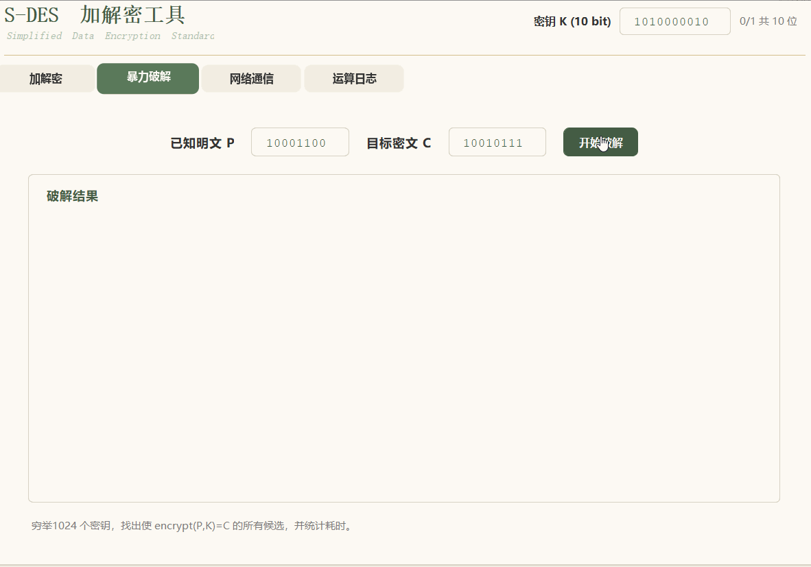

# 使用说明

---

## **目录**

- [一、启动程序](#启动程序)
- [二、加解密标签页](#二加解密标签页)
  - [2.1 界面元素](#21-界面元素)
  - [2.2 单字符加密（第 1 关核心功能）](#22-单字符加密（第1关核心功能）)
  - [2.3 单字符解密](#23-单字符解密)
  - [2.4 字符串加密（第 3 关扩展核心功能）](#24-字符串加密（第3关扩展核心功能）)
  - [2.5 字符串解密](#25-字符串解密)
  - [2.6 常见错误提示](#26-常见错误提示)
- [三、暴力破解标签页（第 4 关核心功能）](#三暴力破解标签页（第4关核心功能）)
  - [3.1 界面元素](#31-界面元素)
  - [3.2 攻击原理](#32-攻击原理)
  - [3.3 操作步骤](#33-操作步骤)
  - [3.4 预期输出](#34-预期输出)
  - [3.5 结果解读](#35-结果解读)
  - [3.6 性能参考](#36-性能参考)
- [四、网络通信标签页（第 3 关扩展）](#四网络通信标签页（第3关扩展）)
  - [4.1 界面元素](#41-界面元素)
  - [4.2 通信流程图](#42-通信流程图)
  - [4.3 操作步骤（本机测试）](#43-操作步骤（本机测试）)
  - [4.4 回执设计说明](#44-回执设计说明)
  - [4.5 服务端主动发送](#45-服务端主动发送)
  - [4.6 常见问题](#46-常见问题)
  - [4.7 局域网 / 跨机测试](#47-局域网/跨机测试)
- [五、运算日志标签页](#五运算日志标签页)
- [六、完整操作流程示例](#六完整操作流程示例)

---

## 一、启动程序

### 三种启动方式

**方式 A：可执行.exe文件下载**

[点击这里下载](https://github.com/qiunci/S-DES-Cipher/releases/latest)


**方式 B：命令行**

```textile
# 进入项目根目录，编译
javac -d out src/sdes/*.java

# 启动主程序（加解密 + 暴力破解 + 网络通信）
java -cp out sdes.SDESGuiApp

# 启动服务端 GUI（用于接收/主动发送）
java -cp out sdes.SDESServerGui
```

**方式 C：IDEA**

1. 打开项目，等待索引完成
2. 找到 `SDESGuiApp.java`
3. 若要做网络通信测试，再对 `SDESServerGui.java` 做同样操作，**两个窗口同时运行**


**顶部密钥栏**是全局的，**四个标签页共用同一个密钥**。任何操作前都要先确认这里的密钥是 10 位 0/1 串。

---

## 二、加解密标签页

### 2.1 界面元素

| 元素                | 说明                                                        |
| ------------------- | ----------------------------------------------------------- |
| **明文** 输入框     | 输入要加密的内容。单字符模式需 8 位 0/1；字符串模式任意文本 |
| **密文** 输入框     | 显示加密结果，或作为解密的输入                              |
| **单字符加密** 按钮 | 用当前密钥加密 8-bit 明文，日志显示完整运算过程             |
| **单字符解密** 按钮 | 用当前密钥解密 8-bit 密文，日志显示完整运算过程             |
| **字符串加密** 按钮 | 把明文框的字符串按 ASCII 逐字符加密                         |
| **字符串解密** 按钮 | 把密文框的字符串逐字符解密                                  |

### 2.2 单字符加密（第 1 关核心功能）

**输入约束**：

- 明文：**必须是 8 位二进制**，如 `10000001`
- 密钥：**必须是 10 位二进制**，如 `1010000010`
- 只允许 `0` 和 `1`，不能有空格或其他字符

**操作步骤**：

1. 确认顶部密钥栏为 `1010000010`
2. 在「明文」输入框填 `10000001`
3. 点击「**单字符加密**」
4. 「密文」框自动填入 `11100111`
5. 切到「运算日志」页，看到完整过程

**日志预期输出**：

```textile

══════════════ 单字符加密运算过程 ══════════════
  输入              : 明文 P = 10000001，密钥 K = 1010000010
  密钥扩展          : k1 = 10100100，k2 = 01000011
  初始置换 IP       : 00010100  (L0=0001, R0=0100)
  第 1 轮 F(R0,k1)  : 0100
  第 1 轮 L0⊕F      : 0101，R 保持 0100
  第 1 轮 f_k1 输出 : 01010100
  交换 SW           : 01000101  (L2=0100, R2=0101)
  第 2 轮 F(R2,k2)  : 1011
  第 2 轮 L2⊕F      : 1111，R 保持 0101
  第 2 轮 f_k2 输出 : 11110101
  逆初始置换 IP⁻¹   : 11100111
  输出              : 密文 C = 11100111
────────────── 加密结束，密文 = 11100111 ──────────────

```

**日志逐行解读**：

| 行                | 含义                                     |
| ----------------- | ---------------------------------------- |
| 输入              | 原始明文和密钥                           |
| 密钥扩展          | 由 K 生成两个子密钥 k1、k2               |
| 初始置换 IP       | 明文经过 IP 置换，分成左右各 4 位 L0、R0 |
| 第 1 轮 F(R0,k1)  | 轮函数 F 的输出（4 位）                  |
| 第 1 轮 L0⊕F      | L0 与 F 异或，得到新左半部               |
| 第 1 轮 f_k1 输出 | 第 1 轮结束的 8 位结果                   |
| 交换 SW           | 左右 4 位互换                            |
| 第 2 轮 F(R2,k2)  | 第 2 轮轮函数输出                        |
| 第 2 轮 L2⊕F      | 第 2 轮左半部异或结果                    |
| 第 2 轮 f_k2 输出 | 第 2 轮结束的 8 位结果                   |
| 逆初始置换 IP⁻¹   | 最终置换得到密文                         |
| 输出              | 最终密文                                 |

### 2.3 单字符解密

**操作步骤**：

1. 在「密文」框填 `11100111`
2. 点击「**单字符解密**」
3. 「明文」框填入 `10000001`
4. 日志显示解密过程

**验证往返**：用加密得到的密文再解密，**必须得到原明文**。这是算法正确性的基本检验。

### 2.4 字符串加密（第 3 关扩展核心功能）

**输入约束**：

- 明文：**任意可输入字符**（英文、数字、中文、符号均可）
- 密钥：仍是 10 位 0/1
- 字符串会按 **ASCII 每字符 1 Byte（8 bit）** 分组，**逐字符独立加密**

**操作步骤**：

1. 在「明文」框填 `Hello`
2. 点击「**字符串加密**」
3. 「密文」框显示一段**乱码字符串**（每个原字符变成 0~255 之间的一个字节）
4. 切到日志页查看每组过程

**日志预期输出**（节选）：

```textile

══════════════ 字符串加密开始 ══════════════
  算法输入          : 明文 "Hello"，密钥 1010000010
── 第 1 组 ────────────────────
  原字符            : 'H'
  ASCII 十进制      : 72
  8-bit 二进制      : 01001000
  S-DES 密文        : 11010010  (十进制 210)
  密文字符          : 不可打印 ASCII:210
── 第 2 组 ────────────────────
  原字符            : 'e'
  ASCII 十进制      : 101
  8-bit 二进制      : 01100101
  S-DES 密文        : 10010111  (十进制 151)
  密文字符          : 不可打印 ASCII:151
── 第 3 组 ────────────────────
  ...
───────────────── 字符串加密结束，密文长度 = 5 ─────────────────

```

**注意**：

- 密文中常有**不可打印字符**（十进制 0~31 或 127~255），日志用 `不可打印 ASCII:210` 标注
- 密文框可能显示为**方块或问号**，这是正常的——它确实是一串二进制数据，不是可读文本
- **复制密文时要注意**：某些编辑器会破坏不可打印字符，建议用日志里的十进制值或十六进制值做记录

### 2.5 字符串解密

**操作步骤**：

1. 把加密得到的密文原样粘贴回「密文」框
2. 点击「**字符串解密**」
3. 「明文」框恢复为 `Hello`
4. 日志显示每组解密过程

**日志预期输出**（节选）：

```textile

══════════════ 字符串解密开始 ══════════════
  算法输入          : 密文长度 5 字符，密钥 = 1010000010
── 第 1 组 ────────────────────
  密文字符          : 不可打印 ASCII:210
  密文 8-bit 二进制 : 11010010  (十进制 210)
  S-DES 明文        : 01001000  (十进制 72)
  还原字符          : 'H'
── 第 2 组 ────────────────────
  ...
───────────────── 字符串解密结束 ─────────────────

```

### 2.6 常见错误提示

| 错误提示                | 原因                 | 解决                       |
| ----------------------- | -------------------- | -------------------------- |
| `明文长度必须为 8 bit`  | 输入不是 8 位        | 补齐到 8 位，如 `00000001` |
| `密钥长度必须为 10 bit` | 顶部密钥栏不是 10 位 | 补齐到 10 位               |
| `明文只能包含 0 和 1`   | 输入含非 0/1 字符    | 只保留 0 和 1              |
| `密钥只能包含 0 和 1`   | 密钥含非法字符       | 只保留 0 和 1              |

---

## 三、暴力破解标签页（第 4 关核心功能）

### 3.1 界面元素

| 元素                  | 说明                                    |
| --------------------- | --------------------------------------- |
| **已知明文 P** 输入框 | 8 位二进制，是你已知的明文              |
| **目标密文 C** 输入框 | 8 位二进制，是 P 用未知密钥加密后的密文 |
| **开始破解** 按钮     | 穷举 1024 个密钥，找出所有候选          |
| **破解结果** 文本区   | 显示穷举统计与候选密钥列表              |

### 3.2 攻击原理

**已知明文攻击**：已知一对 (P, C)，遍历全部 1024 个可能密钥 K，若 `encrypt(P, K) == C`，则 K 是候选密钥。

```textile

for K in 0000000000 .. 1111111111:
    if encrypt(P, K) == C:
        record K as candidate
        
```

### 3.3 操作步骤

1. 在「已知明文 P」填 `10000001`
2. 在「目标密文 C」填 `11100111`
3. 点击「**开始破解**」
4. 结果区显示统计信息，日志区显示命中详情

### 3.4 预期输出

**结果区**：

```textile

穷举密钥总数 : 1024 个
总耗时       : 15.428 ms
平均每密钥   : 15066.4 ns
候选密钥数   : 1
  候选 1 : 1010000010
  唯一密钥：1010000010
  
```

**日志区**：

```textile

══════════════ 暴力破解开始 ══════════════
  已知明文 P      : 10000001
  目标密文 C      : 11100111
  穷举范围        : 0000000000 ~ 1111111111 (共 1024)
  命中候选        : K = 1010000010   (第 643 次尝试)
  ──────────────────────────────
  穷举密钥总数    : 1024
  总耗时          : 15.428 ms
  平均每密钥      : 15066.4 ns
  候选密钥数      : 1
    候选 1        : 1010000010
────────────── 暴力破解结束 ──────────────

```

### 3.5 结果解读

| 情形     | 说明                                              |
| -------- | ------------------------------------------------- |
| 候选 = 1 | 唯一确定密钥，可放心使用                          |
| 候选 > 1 | 多解，需再用**第二组 (P,C)** 缩小范围，求交集     |
| 候选 = 0 | 输入 (P,C) 不匹配，或密钥空间遍历有误（一般不会） |

**为什么会有多解？** 1024 个密钥 → 256 种可能密文，平均每个密文对应 **4 个密钥**。所以**一组 (P,C) 常常不够**唯一确定 K。

### 3.6 性能参考

| 项目         | 参考值                      |
| ------------ | --------------------------- |
| 密钥总数     | 1024                        |
| 总耗时       | 约 15 ms（普通 PC，单线程） |
| 平均每密钥   | 约 15 μs                    |
| 是否需多线程 | 不需要，单次已 < 20 ms      |

> 演示 GIF

 

---

## 四、网络通信标签页（第 3 关扩展）

### 4.1 界面元素

| 元素                | 说明                                   |
| ------------------- | -------------------------------------- |
| **服务器 IP**       | 目标服务器地址，本机测试用 `127.0.0.1` |
| **端口**            | 目标服务器监听端口，默认 `8888`        |
| **要发送的消息**    | 要加密并发送的明文                     |
| **加密并发送** 按钮 | 加密后通过 TCP 发出，等待回执          |

### 4.2 通信流程图

```text
Client SDESGuiApp                     Server SDESServerGui
     |                                        |
     | 1. user types hello                    |
     | 2. encrypt with key K                  |
     | 3. TCP connect ----------------------> |
     | 4. write(ciphertext) ----------------> |
     |                                        | 5. read ciphertext
     |                                        | 6. decrypt with K
     |                                        | 7. log source + plaintext
     | 5. read(receipt) <-------------------- | 8. write("recv"+Base64)
     | 6. show receipt, verify                |
     | 7. close                               | 9. close
```

### 4.3 操作步骤（本机测试）

**步骤 1：启动服务端**

```bash
java -cp out sdes.SDESServerGui
```

服务端窗口打开，日志区第一行显示：

```
服务端启动，监听端口 8888 ...
```

**步骤 2：客户端填参数**

| 字段      | 值          |
| --------- | ----------- |
| 服务器 IP | `127.0.0.1` |
| 端口      | `8888`      |
| 消息      | `Hello`     |

> **重要**：客户端顶部密钥栏**必须**和服务端 `SHARED_KEY = "1010000010"` 一致，否则服务端解不出明文。

**步骤 3：点击「加密并发送」**

**客户端日志**：

```textile

══════════════ TCP 加密发送 ══════════════
  服务器          : 127.0.0.1:8888
  消息            : Hello
  密文长度        : 5
  发送密文(Hex)   : D3 4A 91 7C 0B
  已发送至        : 127.0.0.1:8888
  收到回执长度    : 9 字符
  收到回执(Hex)   : CA D5 B5 BD 44 33 41 39 31 ...（"收到" + Base64）
  回执前缀        : "收到"
  回执携带密文    : D3 4A 91 7C 0B
  与我发送的密文一致? true
────────────── 发送结束 ──────────────

```

**服务端日志**：

```textile

══════════════ 收到连接 ══════════════
  信息来源        : 127.0.0.1:52341
  连接时间        : 14:32:07
  收到密文长度    : 5 字符
  收到密文(Hex)   : D3 4A 91 7C 0B
── 第 1 组 ────────────────────
  密文字符        : 不可打印 ASCII:211
  密文 8-bit 二进制 : 11010011  (十进制 211)
  S-DES 明文      : 01101000  (十进制 104)
  还原字符        : 'h'
── 第 2 组 ────────────────────
  ...
  解密明文        : "Hello"
────────────── 回执发送 ──────────────
  已回执给        : 127.0.0.1:52341
══════════════ 处理结束 ══════════════

```

### 4.4 回执设计说明

服务端回执 = `"收到" + Base64(原密文)`：

| 部分              | 作用                                                     |
| ----------------- | -------------------------------------------------------- |
| `"收到"`          | 中文前缀，标识"我已收到"                                 |
| `Base64(原密文)`  | 把原始密文转成纯 ASCII 编码，避免中文/二进制混排破坏字节 |
| 整体用 UTF-8 传输 | 中文字符与 Base64 都是 UTF-8 安全字符                    |

客户端收到后：

1. 剥离 `"收到"` 前缀
2. Base64 解码得到原密文
3. 与发送的密文比对，`一致? true` 表示"服务端确实收到了我发的密文"

### 4.5 服务端主动发送

`SDESServerGui` 窗口下方也有一个"加密并发送"面板，可以**反向发送**：

1. 填对方 IP、端口（客户端若要接收，客户端需有监听能力）
2. 填消息
3. 点击「加密并发送」→ 服务端加密并发出，等待对方回执

这样两端都能主动发、都能被动收。

### 4.6 常见问题

| 问题                     | 原因                    | 解决                                |
| ------------------------ | ----------------------- | ----------------------------------- |
| `Connection refused`     | 服务端未启动 / 端口写错 | 先启动服务端，确认端口一致          |
| 服务端解密乱码           | 两端密钥不一致          | 客户端密钥栏改成 `1010000010`       |
| `Address already in use` | 端口已被占用            | 换端口，或关掉已占用的程序          |
| 客户端读不到回执         | 服务端未回写 / 网络延迟 | 检查服务端回执代码，或稍等重试      |
| 中文前缀变乱码           | 传输编码不一致          | 回执整体用 UTF-8，密文部分用 Base64 |

### 4.7 局域网 / 跨机测试

如果要在**两台电脑**上测：

1. 服务端电脑运行 `SDESServerGui`，用 `ipconfig`（Windows）/`ifconfig`（Mac/Linux）查本机 IP，如 `192.168.1.5`
2. 客户端电脑在「服务器 IP」填 `192.168.1.5`，端口 `8888`
3. 确保**服务端电脑防火墙允许 8888 端口入站**
4. 两台电脑的密钥栏保持一致

---

## 五、运算日志标签页

### 5.1 日志用途

- **调试**：查看每一步中间结果，定位错误
- **演示**：向老师/同学展示算法流程
- **证据**：作为测试报告截图来源
- **复制**：点「复制全部」可直接粘贴到 Word/文档


## 六、完整操作流程示例

### 场景 1：单字符加解密（第 1 关）

```

1. 顶部密钥栏填：1010000010
2. 加解密页 → 明文框填：10000001
3. 点「单字符加密」 → 密文框 = 11100111
4. 切到日志页，截图保存过程
5. 切回加解密页，点「单字符解密」 → 明文框恢复 = 10000001
6. 确认往返一致 ✅
```

### 场景 2：字符串加解密（第 3 关）

```

1. 顶部密钥栏填：1010000010
2. 加解密页 → 明文框填：Hello
3. 点「字符串加密」 → 密文框显示乱码
4. 切到日志页，查看逐字符过程
5. 复制密文，粘回密文框
6. 点「字符串解密」 → 明文框恢复 Hello
7. 确认往返一致 ✅
```

### 场景 3：TCP 通信（第 3 关）

```

1. 启动 SDESServerGui，监听 8888
2. 启动 SDESGuiApp
3. 网络通信页 → IP=127.0.0.1，端口=8888，消息=Hello
4. 点「加密并发送」
5. 看服务端日志：来源 IP + 解密明文
6. 看客户端日志：回执携带密文一致 ✅
```

### 场景 4：暴力破解（第 4 关）

```

1. 先执行场景 1，得到 (P=10000001, C=11100111)
2. 暴力破解页 → 已知明文 P=10000001，目标密文 C=11100111
3. 点「开始破解」
4. 结果区显示：候选数=1，候选=1010000010，耗时约 15 ms
5. 录屏保存，作为"多快完成破解"的证据
```

### 场景 5：封闭测试（第 5 关）

```

1. 固定明文 P=10000001
2. 用不同密钥 K 加密，找是否有相同密文 C 出现
3. 或用暴力破解 + 不同 (P,C) 对，统计候选密钥数
4. 记录数据，绘制柱状图，写入测试报告
```
